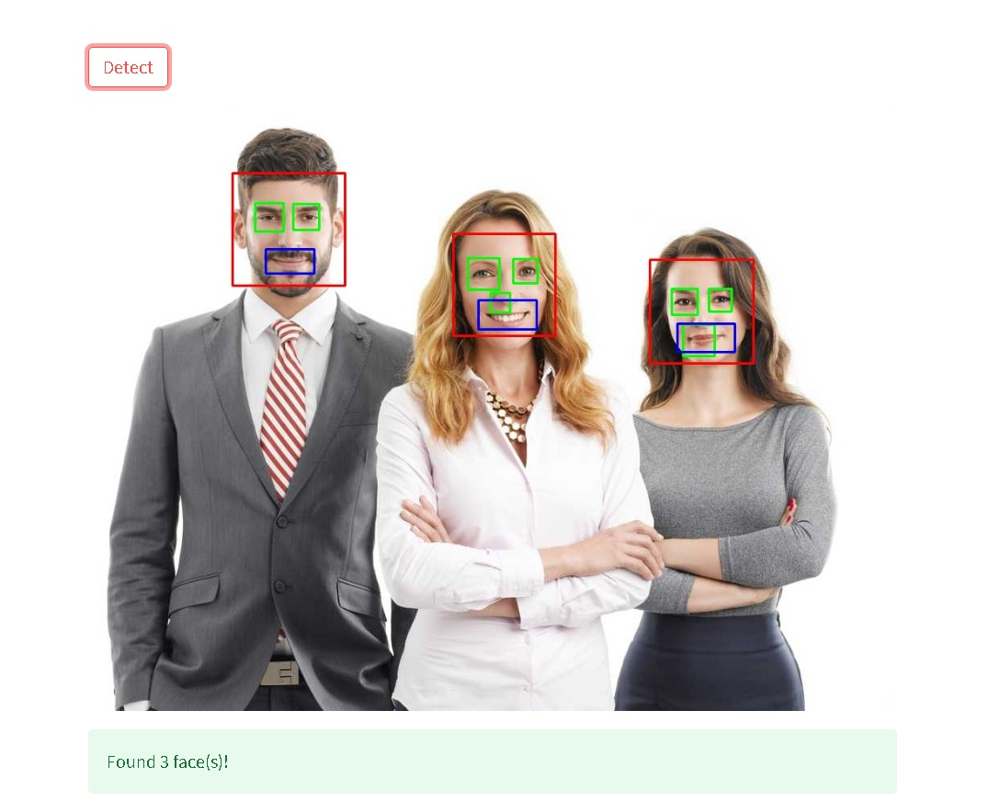

# FACE DETECTION SYSTEM
## 1. Methodology
## 2. Description
This face detection web application is built using Harr Cascade Classifier and libraries like cv2 and streamlit. The code is then deployed on streamlit.

## 3. Input/Output

## 4. Live Link
Check out the deployed app :

https://chavvi23-face-detection-app-4xmag1.streamlit.app/
## 5. Screenshot of the Interface

