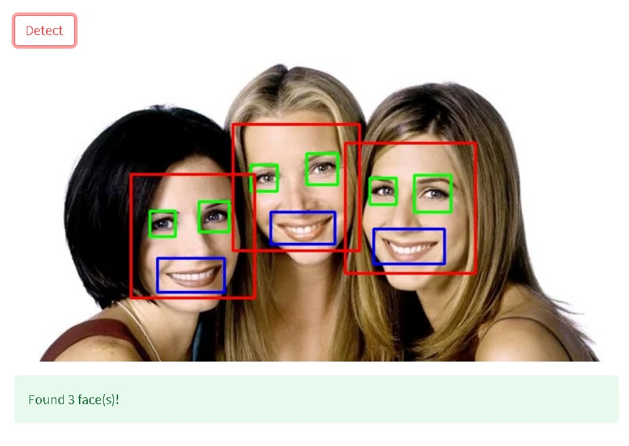
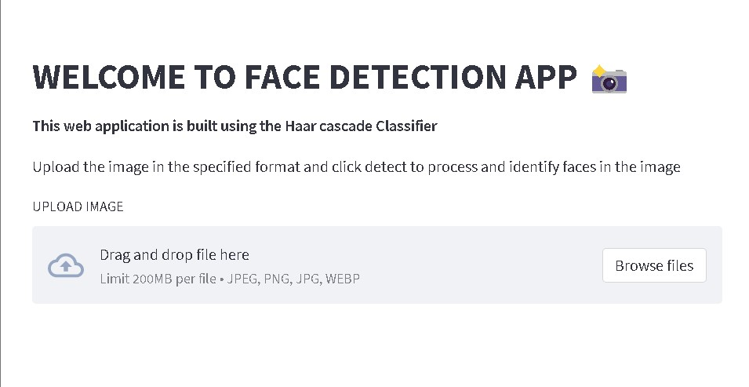

# FACE DETECTION SYSTEM
## 1. Methodology
This face detection model uses Haar Cascade Classifier. The working can be: 

Input Image -> Haar feature traversal -> Integral image formation -> Cascade of Classifiers -> Faces Detected
## 2. Description
This face detection web application is built using Harr Cascade Classifier and libraries like cv2 and streamlit. This application recognises the faces in the image uploaded, along with this, it also identifies the smile and eyes, with blue and green color respectively. The code is then deployed on streamlit.

## 3. Input/Output

## 4. Live Link
Check out the deployed app :

https://chavvi23-face-detection-app-4xmag1.streamlit.app/
## 5. Screenshot of the Interface

